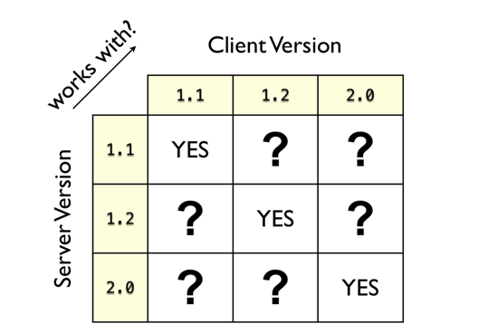
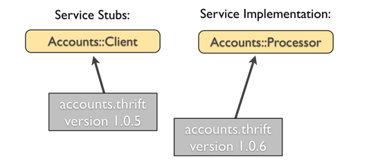
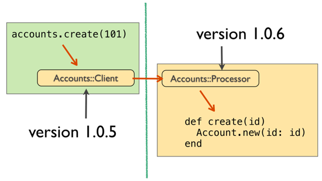

__credit__ = "Bill Kayser"

## Introduction

This repo is meant to illustrate best practices for managing version
compatibility of services based on thrift.  It focuses on an SOA
architecture where you generally run one version of a service
implementation but may have clients with older versions of the service
stubs.

### Terminology

When developing a service implementation, a principle design
consideration is compatibility with clients of the service.  In this
context there is a notion of backward compatibility and forward
compatibility.  Forward compatibility describes a version of the
service that will work with clients of future versions of that
service.

In an SOA environment where you intend to only ever run one version of
a given service we're not going to concern ourselves with forward
compatibility (top right in the matrix) and instead focus on backward
compatibility (bottom left).

Backward compatibility is a quality of a service implementation where
it will work with clients running with an earlier version of the
client libraries.  For Thrift this means clients using an older
version of the service stubs will still work with a newer version.

Consider a typical deployment of a given Thrift service.

The interface is defined in the IDL which is used to generate service
stubs for a client application and a platform specific service
interface that is implemented by the service.

If the service implementor now modifies the service interface, a new
version of the service stubs is generated.  But not all clients will
upgrade their stubs immediately.  The new version of the service is
considered *backward compatible* with the earlier generated stubs if
the clients using the old service stubs can still connect to the
service and invoke methods successfully.  More specifically, the new
verison of the service is _binary backward compatibile_ with the
earlier versions.

Note that we are focusing on the compatibility of interfaces at the
protocol layer only.

### Semantic Versioning

In order to identify the compatibility characteristics of any version
of the service, we can adopt a form of [semantic
versioning](http://semver.org/) tailored to the notions of binary
compatibility.  With this proposal, the form the definitions of major,
minor and patch numbers look like this:

    MAJOR.MINOR.PATCH

An increment of the MAJOR (first) number represents an binary backward
incompatible upgrade to the previous version.  Clients will not be
able to connect to this version of the service without updating their
service stubs to the latest version, which will require recompilation
and changes to the source.

In other words, you can't connect to a 2.* service with stubs generated
from a 1.* version of the IDL.

The meaning of MINOR and PATCH increments would still align with the
conventional semantic versioning rules.

## Compatibility Examples in Thrift

Whenever the IDL for a service is modified, new service stubs are
generated.  Depending on the change, the new version may be backward
binary compatible or incompatible with clients trying to connect with
older versions of the stubs.

### Backward Compatible Changes -- Good!

* Adding new methods or structs
* Adding a non-required field to a struct
* Changing a method return type from void to anything else
* Removing an exception from a method signature
* Removing a field from a struct
* Renaming a struct
* Adding an argument to a method with or without a default value
* Removing an argument from a method
* Changing the order of arguments in a method
* Changing the namespace

These changes will still allow older clients to connect to the new
version of the server.

### Backward Incompatible Changes -- Bad!

The following changes require all clients to update their stubs to the
latest versions generated.  Clients connecting with older versions of
the stubs will get exceptions on their method invocations.

* Removing or renaming a method
* Changing the type of an argument in a method
* Changing the declared type of a return value, or changing it to void
* Adding an exception to a method (with a non-void return type)

Adding an exception to any method should really be considered to break
backward compatibility, but an oddity of thrift's implementation is
that if you throw an exception from the server that is not expected by
the client, it will just be ignored, _but only if the method is
declared void_.

## Running the Examples

You can see examples of the compatible changes listed above in a
sample thrift service called the `AIS::Accounts` service.

There are three different versions of this service:

* 1.0.0: The first version
* 1.0.1: The second version with changes that are source compatible with clients written with the V1 stubs
* 1.1.0: The third version with additional changes that are binary compatible but not source compativle with V1 clients.
* 2.0.0: Major version which is not compatible with 1.* clients.

You can run the [server](examples/server.rb) as a rack application.
The server implements versions 1.1.0 and 2.0.0 as distinct rack
applications on separate endpoints.

You can a sample client with the [client runner](examples/client.rb)
ruby script.  It take a single command line argument, the version of
the interface to use: 1.0.0, 1.0.1, 1.1.0, or 2.0.0.  To demonstrate
binary compatibility, the 1.* versions of the client all connect to
the local 1.1.0 server stood up by the server rack app.  When you run
the 2.0.0 version of the client it connects to the 2.0.0 endpoint in
the rack app.

First install the thrift binaries using your platform installer (yum, brew, etc).

Then install your gems:
    cd examples
    gem install bundler
    bundle install

Next generate the service stubs:

    ./gen.sh

Start up the server.  This instantiates server implementations of the
1.1.0 and 2.0.0 interfaces.

    rackup

Now run each version of the client.

    ruby client_v100.rb
    ruby client_v101.rb
    ruby client_v110.rb
    ruby client_v200.rb

In [client.rb](examples/client.rb) you can study the changes required
in each of the versions of the client in order to upgrade the stubs
for that version.

So what's the point of runnable examples?  If you have a question
about the effect of any particular kind of change on clients the best
way to answer it is to actually try it out.  These examples all use
ruby but you could verify some of the assumptions using clients
written in other languages.
